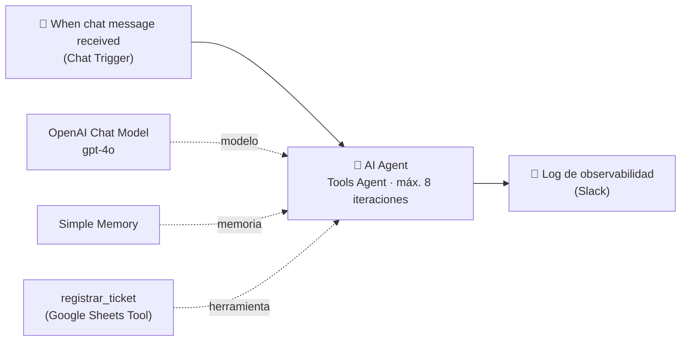

# Entregable 1 — Agente base y motor de razonamiento

**Checkpoint de Configuración e Interfaces Agénticas (M1)**
Archivo: [`checkpoint1_bruno_acorsi.json`](checkpoint1_bruno_acorsi.json)

## Qué hace

**ProTable Support Triage Agent** recibe por chat la consulta de un restaurante que
usa ProTable, la analiza (qué, cómo, cuándo, dónde), la clasifica por categoría y
prioridad, y decide de forma autónoma si la resuelve con el FAQ oficial o si la
registra como ticket para el equipo humano. Cada interacción termina en un reporte a
Slack con la consulta, la respuesta y las herramientas que usó el agente.

## Cómo cumple la consigna

| Requisito | Cómo está resuelto |
|---|---|
| **Disparador** | `Chat Trigger` (*When chat message received*) captura el mensaje desestructurado del usuario. |
| **AI Agent en modo Tools Agent** | Nodo AI Agent v3.1. En esta versión el Tools Agent es el único modo del nodo, por eso ya no aparece un selector de modo. |
| **Modelo de lenguaje nativo** | `OpenAI Chat Model` con **gpt-4o**, conectado al puerto *Chat Model* del agente. |
| **Guardrail de iteraciones** | *Options → Max Iterations* = **8** (rango pedido: 5 a 10). |
| **System Prompt modular** | Rol y objetivo → Empresa (ámbito) → Usuario y estilo → Fuentes permitidas → **Guardrails** (lista explícita de lo que nunca hace) → Proceso de triage → Clasificación, prioridad y **escalamiento** → Uso de la herramienta → Formato de respuesta → Ejemplos → Checklist. Redactado sin lenguaje inclusivo. |
| **Herramienta lateral** | `registrar_ticket` (Google Sheets, *Append row*) conectada al puerto *Tool* del agente, no como nodo secuencial. |
| **Descripción semántica extensa** | Descripción manual de ~1.600 caracteres: cuándo usarla, cuándo no (FAQ, datos incompletos, spam, duplicados) y cómo informar el resultado. Cada columna usa `$fromAI` con su propia descripción. |
| **Sin bloques de decisión rígidos antes del agente** | El flujo es Trigger → Agente directo. La decisión de usar la herramienta la toma el modelo. |
| **Observabilidad** | Nodo final de Slack que publica la consulta, la respuesta y el **execution log**: cada herramienta invocada con su input y su resultado (`returnIntermediateSteps` activado). |

## Validación (prueba manual)

Ejecución manual del 2026-09-26, con el mensaje:

> Hola, soy Bruno Acorsi, encargado del local "Cafe Prueba Checkpoint 1". Desde hace
> una hora el cobro con MercadoPago desde el menú QR queda en "procesando" y no se
> acredita ningún pago, en todas las mesas. Ayer funcionaba bien. Necesito que quede
> registrado para que lo revise el equipo.

Resultado: **todos los nodos en verde (8,5 s)**.

1. El agente clasificó el caso como `BILLING`, prioridad `P2 - HIGH`.
2. Decidió por su cuenta invocar `registrar_ticket`, y la fila se agregó en la planilla.
3. El log de observabilidad llegó a Slack con el detalle de la herramienta ejecutada.

## Cómo probarlo

1. Importá `checkpoint1_bruno_acorsi.json` en n8n.
2. Asigná tus credenciales en **OpenAI Chat Model**, **registrar_ticket** (Google
   Sheets OAuth2, con una planilla que tenga la hoja `Tickets` y las columnas
   `Nombre/contacto`, `Empresa`, `Categoría`, `Prioridad`, `Resumen`) y **Log de
   observabilidad** (Slack, eligiendo tu canal).
3. Abrí el chat del workflow y mandá un mensaje con contacto, local y problema.
   - Una consulta de uso ("¿cómo cambio el logo del menú?") debería responderse sin
     ticket.
   - Una falla operativa con los datos completos debería disparar `registrar_ticket`.

## Próximo paso (M2)

Sumar un Manager que derive a workers especializados (facturación, soporte, ventas)
como sub-workflows, partiendo de este mismo `.json`.
