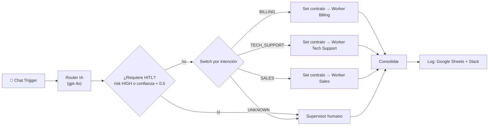

# Entregable 2 — Orquestación multi-agente (Manager-Worker)

**Checkpoint de pre-entrega 2 (M2).** Entrega formal: [`preentrega_modulo2_acorsi_bruno.pdf`](preentrega_modulo2_acorsi_bruno.pdf)

El agente de triage del Módulo 1 pasa al patrón **Manager-Worker**: un workflow Manager clasifica el
mensaje con una taxonomía cerrada y delega la resolución a especialistas que viven en lienzos separados
como sub-workflows.

## Archivos

| Archivo | Qué es |
|---|---|
| `manager_modulo2_acorsi_bruno.json` | Manager: Chat Trigger → Router IA → HITL / Switch → Set de contrato → Execute Workflow → log |
| `worker1_billing_acorsi_bruno.json` | Worker de facturación, cobros y suscripciones |
| `worker2_tech_support_acorsi_bruno.json` | Worker técnico, con la herramienta `registrar_ticket` del M1 |
| `worker3_sales_acorsi_bruno.json` | Worker comercial: planes y contratación |
| `preentrega_modulo2_acorsi_bruno.pdf` | Documento entregado: capturas, esquema de datos y criterio de enrutamiento |
| `*.png` | Capturas usadas en el PDF |
| `Logs_Multiagente_M2.xlsx` | Plantilla de la planilla de log |

## Arquitectura

## Contrato de datos

- **Ida (Manager → Worker):** `original_input`, `intent`, `confidence`, `risk`, `session_id`. Un nodo Set limpia el payload antes de cada delegación.
- **Vuelta (Worker → Manager):** `{status, worker, respuesta, requires_human, error}`.
- **Robustez:** *Wait for Sub-Workflow Completion* activado, 2 intentos, timeout de 60 s por worker, y un JSON de contingencia si el especialista o el worker fallan.

## Cómo importarlo

1. Importá primero los tres workers y después el manager (**Workflows → Import from File**).
2. En cada nodo **Delegar a Worker …**, elegí el worker correspondiente de tu instancia.
3. Asigná tus credenciales: OpenAI, Google Sheets y Slack.
4. Publicá los workers antes que el manager.
