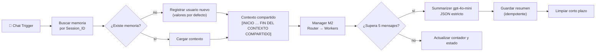

# Entregable 3 — Memoria persistente y resumen agéntico

**Checkpoint de pre-entrega 3 (M3).** Entrega formal: [`PreEntrega_Modulo3_BrunoAcorsi.pdf`](PreEntrega_Modulo3_BrunoAcorsi.pdf)

El manager multi-agente del M2 suma una **capa de memoria híbrida**. El largo plazo es una fila por
`Session_ID` en Google Sheets; el corto plazo son los últimos intercambios en la memoria de n8n. Cuando
la conversación supera los 5 mensajes, un modelo económico (`gpt-4o-mini`) la resume en un JSON estricto
y sobreescribe la fila de la sesión. Los workflows del M2 quedan intactos: el M3 son copias con sufijo `_modulo3_`.

## Archivos

| Archivo | Qué es |
|---|---|
| `manager_modulo3_acorsi_bruno.json` | Manager M2 + lectura y escritura de memoria + summarization |
| `worker1_billing_modulo3_acorsi_bruno.json` | Worker Billing con la memoria en su System Prompt |
| `worker2_tech_support_modulo3_acorsi_bruno.json` | Worker Tech Support (agente del M1 + `registrar_ticket`) con memoria |
| `worker3_sales_modulo3_acorsi_bruno.json` | Worker Sales con memoria |
| `PreEntrega_Modulo3_BrunoAcorsi.pdf` | Documento entregado: lienzo, prompt del summarizer, esquema de la base y anexo de QA |
| `1a-…izquierda.png`, `1b-…derecha.png` | Capturas del lienzo usadas en el PDF |

## Circuito de memoria

## Base de memoria (`Memoria_M3`)

| Columna | Tipo | Contenido |
|---|---|---|
| `Session_ID` | texto (clave) | Identificador de la conversación. Una fila por sesión |
| `Fecha_Actualizacion` | fecha ISO | Última actualización de la fila |
| `user_name` | texto | Nombre del usuario, detectado por el router |
| `Estado_Caso` | texto | `NUEVO` · `EN_CURSO` · `ESCALADO_HUMANO` · `ERROR` · `RESUELTO` |
| `Resumen_Consolidado` | texto (JSON) | `{asunto_principal, puntos_clave, accion_requerida}` |
| `Datos_Clave` | texto | Los puntos clave y la acción, en texto plano |
| `contador_mensajes` | número | Mensajes desde el último resumen |

La base guarda solo el resumen y los datos clave: nunca la conversación completa, ni payloads, ni logs técnicos.

## Cómo importarlo

1. Creá una planilla de Google Sheets con las 7 columnas de arriba.
2. Importá los tres workers y después el manager.
3. En el manager, apuntá los 4 nodos de Google Sheets de memoria a tu planilla, y los 3 nodos **Delegar a Worker …** a tus workers.
4. Asigná tus credenciales (OpenAI, Google Sheets y Slack) y publicá primero los workers.
5. Probalo desde el chat con 6 o más mensajes en la misma conversación.
